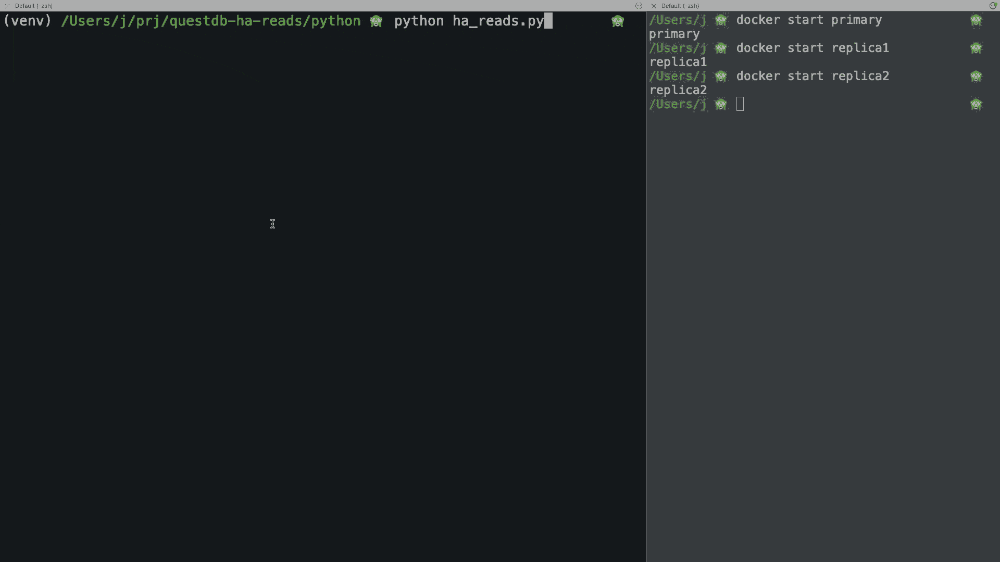

# QuestDB Highly Available Reads

This is an example repository companion to the blog post [Highly Available Reads with QuestDB](https://questdb.com/blog/highly-available-reads-with-questdb),
showing how you can get HA reads when using multiple QuestDB instances.

The goal of this example is to demonstrate how you can point your client application to multiple QuestDB replicated
instances, and get automatic failover of any query to the next available instance, so your queries are always served
from an instance in your cluster even in
the event of a server going down (accidentally or for scheduled maintenance).



Replication is out of the box when using QuestDB Enterprise. Implementing replication by adding a custom layer on top
of QuestDB Open Source is discouraged, as consistency and data recovery is not guaranteed.

## Starting the demo environment

We recommend using a QuestDB cluster with at least one read-replica, so you can verify the client applications failover
on consistent data.

If you don't have access to QuestDB Enterprise, or if you prefer to test in a local environment, for the purpose of this
demo you can start three independent, not replicated, QuestDB instances on a single host using Docker. Note this will
not replicate any data, as instances are unaware of each other.

### Start several QuestDB containers using Docker

```sh
docker run --name primary -d --rm -e QDB_CAIRO_WAL_TEMP_PENDING_RENAME_TABLE_PREFIX=temp_primary  -p 9000:9000  -p 8812:8812 questdb/questdb

docker run --name replica1 -d --rm -e QDB_CAIRO_WAL_TEMP_PENDING_RENAME_TABLE_PREFIX=temp_replica1  -p 9001:9000  -p 8813:8812 questdb/questdb

docker run --name replica2 -d --rm -e QDB_CAIRO_WAL_TEMP_PENDING_RENAME_TABLE_PREFIX=temp_replica2  -p 9002:9000  -p 8814:8812 questdb/questdb
```

So you have now three instances running, each listening on different HTTP port (9000, 9001, and 9002) and postgresql port (8812, 8813, 8814).
I passed an environment variable to set a different temporary path on each instance; this way, I can easily identify which instance
I am connecting to when examining the parameters. On Enterprise, we can just check the `replication.role` parameter.

```sql
select value from (show parameters) where property_path IN ( 'replication.role', 'cairo.wal.temp.pending.rename.table.prefix') limit 1;
```

In the case of running QuestDB Enterprise, the output for the command will be either `primary` or `replica`. In the case
of running the local docker setup, the output will be `temp_primary`, `temp_replica1`, and `temp_replica2`.

### Running the demo


Now that the three containers are running, if you start any of the demos provided they should all show the output. Note
that of you are running QuestDB Enterprise, and you don't want to change the config variable to

replication.role

```
temp_primary
temp_primary
temp_primary
```

You can then stop the primary on a separate terminal with:

```
docker stop primary
```

And you should see, after the app notices the connection was failing, that the value has changed to:

```
temp_replica1
temp_replica1
temp_replica1
```

You can keep stopping and restarting containers to see how the demo behaves. When all containers are down, the demo
will just keep retrying until a connection succeeds.

All the demos will send the query 250 times at 300ms intervals and then will exit.


## Python

The demo uses psycopg3. It is easy to adapt to psycopg2, as the overall structure would be the same and psycopg2 also
supports multiple hosts on the connection string.

```sh
pip install -r requirements.txt
python ha_reads.py
```


## Java

The demo is packed as a maven project. You can either execute from your IDE, or use the `mvn` command line:

```sh
mvn compile exec:java -Dexec.mainClass=HAReads
```

## Node.js

Node.js supports libpq-style multi-host connection strings only when using `pg-native`. The default `pg` client (pure JS)
does not support it. If you want cross-platform compatibility or don’t want to rely on native bindings, you need to
implement the failover logic manually.

What we are doing here is storing all the hosts in an array, and test each one in a sequence until successful. The rest of
 the process is identical to what we are doing in the other languages.

```sh
npm install
npm start
```

## Dot Net (C#)

```sh
dotnet restore
dotnet run
```

## Go

```sh
go mod tidy
go run .
```

## Rust

```sh
cargo run
```

## C++

The build process differs depending on your platform: **Linux**, **macOS**, or **Windows**.

### Linux

Use `apt` (or your distro’s equivalent) to install dependencies:

```sh
sudo apt update
sudo apt install -y g++ cmake pkg-config libpqxx-dev
```

Now build with:

```sh
mkdir -p build && cd build

cmake ..
make
```

Execute the demo with:

```sh
./HAReads
```

You can clean up with:

```sh
cd build
make clean
```

### macOS

Use Homebrew to install `libpqxx`. This also pulls in the required `libpq`:

```sh
brew install libpqxx
```

Now build with:
```sh
git clone https://github.com/YOUR_REPO/questdb-ha-reads
cd questdb-ha-reads/cpp
mkdir -p build && cd build

cmake .. \
  -DCMAKE_PREFIX_PATH=/opt/homebrew/opt/libpqxx \
  -DCMAKE_LIBRARY_PATH=/opt/homebrew/lib \
  -DCMAKE_INCLUDE_PATH=/opt/homebrew/include

make
```

Execute the demo with:

```sh
./HAReads
```

You can clean up with:

```sh
cd build
make clean
```

### Windows

You can use WSL for compatibility or MSYS2

#### WSL

Install WSL + Ubuntu:

```sh
wsl --install
```

Inside WSL terminal, you can now follow the same process we described above for Linux

#### MSYS2

Open MSYS2 MinGW 64-bit shell and run:

```sh
pacman -Syuu
pacman -S --needed mingw-w64-x86_64-toolchain cmake git pkgconf mingw-w64-x86_64-libpqxx
```

Now build with:
```sh
mkdir -p build && cd build

cmake -G "MinGW Makefiles" ..
mingw32-make
```

Execute the demo with:

```sh
./HAReads.exe
```

You can clean up with:

```sh
cd build
mingw32-make clean
```
